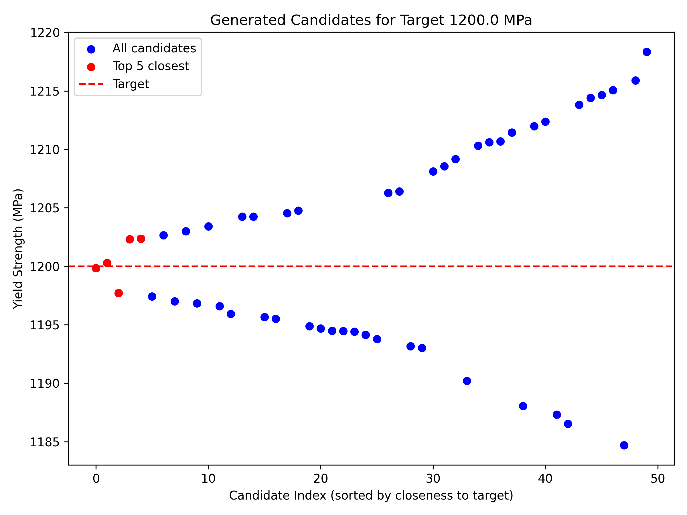

# Inverse Design of Refractory High-Entropy Alloys using CVAE

This project explores the **inverse design** of **Refractory High-Entropy Alloys (RHEAs)** with target yield strength using a **Conditional Variational Autoencoder (CVAE)**.  
Instead of trial-and-error alloy design, the CVAE learns to generate candidate alloys conditioned on target mechanical properties (e.g., yield strength).

---

## Objectives
- Build a **conditional generative model** that maps desired yield strength → alloy composition.  
- Leverage a **CVAE** architecture with a property-predicting head to align latent space with yield strength.  
- Enable **sampling & refinement** of alloy candidates close to target properties.  
- Provide interpretable **alloy formulas** (mole fraction basis) for generated candidates.

---

## Dataset
- **Source**: Literature dataset of RHEAs with compositions and mechanical properties.  
- **Features**:  
  - Elemental fractions (Al, Mo, Nb, Ta, Ti, V, W, Zr, etc.)  
  - Material properties (density, modulus, testing temp, etc.)  
  - Encoded categorical features (phase type, testing conditions)  
- **Target**: Yield Strength (MPa)

---

## Repo Structure
```
RHEA-Inverse-Design-Using-VAE/
│
├── data/              # Raw & processed datasets
├── models/            # Saved CVAE checkpoints
├── outputs/           # Generated CSVs & plots
├── src/
│   ├── cvae.py        # Model definition
│   ├── train.py       # Training loop
│   ├── generate.py    # Candidate generation
│   └── evaluate.py    # Evaluation & visualization
└── README.md
```

---

## Methodology

### Model Architecture
- **Encoder**: Encodes alloy features + target property → latent distribution ((μ, σ))  
- **Latent space**: Reparameterization trick samples latent vector z  
- **Decoder**: Generates candidate alloy features from (z, y)  
- **Property Head**: Predicts yield strength from latent z for alignment  

**Total Loss**:  
L = Recon(x, x̂) + β * KL(q(z|x,y) || p(z|y)) + λ_prop * MSE(y, ŷ)

---

## Training Setup

| Setting            | Value                     |
|--------------------|---------------------------|
| Optimiser          | AdamW                     |
| Learning Rate      | 1e-3                      |
| Weight Decay       | 1e-5                      |
| Epochs (max)       | 200                       |
| Early Stopping     | Patience = 60             |
| Batch Size         | 16 / 32                   |
| Latent Dimension z | 4                         |
| Hidden Units       | 128 (encoder/decoder), 64 (prop head) |
| Activation         | GELU                      |
| Gradient Clipping  | 1.0                       |
| Data Split         | 80/20 train/val           |
| Scaling            | StandardScaler (x), MinMax (y) |

---

## Candidate Generation & Evaluation

1. **Target property input**: e.g., yield strength = 1200 MPa  
2. **Conditional prior** generates latent vector distribution ((μ, σ))  
3. **Latent refinement** optimises z so property head prediction ≈ target  
4. **Decoder** reconstructs candidate alloy compositions  
5. **Post-processing**:  
   - Normalise fractions to sum=1  
   - Round categorical encodings  
6. **Output**: Candidate alloys + predicted yield strengths  

---

## Outputs

### Example: Target Yield Strength = 1200 MPa

#### Top-5 Closest Alloys (CSV)
File: [`outputs/top_5_alloys_y1200.csv`](outputs/top_5_alloys_y1200.csv)

| Predicted_Yield_Strength | Alloy_Formula            |
|---------------------------|--------------------------|
| 1199.83                  | Al0.07Co0.00Cr0.00...Zr0.13 |
| 1200.28                  | Al0.06Co0.00Cr0.00...Zr0.13 |
| 1197.71                  | Al0.06Co0.00Cr0.00...Zr0.13 |
| 1202.32                  | Al0.07Co0.00Cr0.01...Zr0.13 |
| 1202.37                  | Al0.06Co0.00Cr0.00...Zr0.13 |

#### Plot: Generated Candidates


- Blue: All generated candidates  
- Red: Top-5 closest to target  
- Dashed line: Target yield strength (1200 MPa)

---

## Preliminary Results
- CVAE generates **valid alloy compositions** with predicted yield strengths within ±20 MPa of target.  
- Alloy formulas are interpretable (e.g., `Al0.06Mo0.09Nb0.21Ti0.22V0.11Zr0.13...`).  
- Surrogate model evaluation was attempted (ExtraTrees) but showed misalignment → deferred.  
- Current pipeline: **generate → predict (via CVAE head) → select closest alloys**.

---

## Next Steps
- **Multi-Property Conditioning**: Extend the CVAE framework to generate alloys based on **temperature-dependent yield strength**, enabling more realistic design under varying operating conditions.  
- **Element Subset Design**: Restrict generation to **4–5 element subsets** rather than the entire compositional space, improving interpretability and alignment with experimental alloy design practices.  
- **Validation**: Benchmark generated alloys against the **TSNED (Thermo-physical Simulation & Experimental Database for Materials)** or equivalent datasets to validate performance and enhance credibility.  

---

## Conclusion
This work demonstrates the potential of **conditional generative models** for **inverse materials design**.  
By conditioning on yield strength, the CVAE framework generates alloy compositions close to target properties — paving the way for **data-driven accelerated alloy discovery**.
