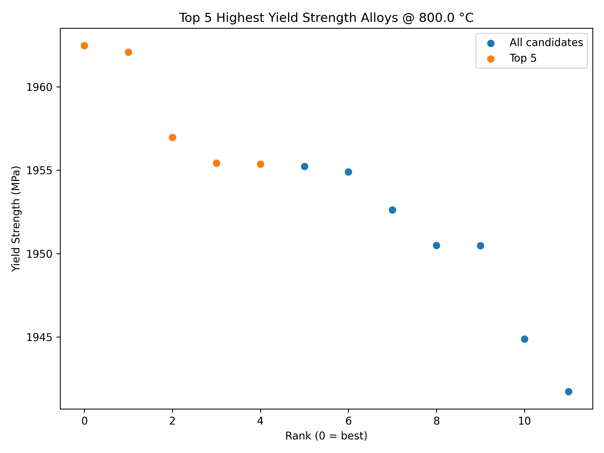
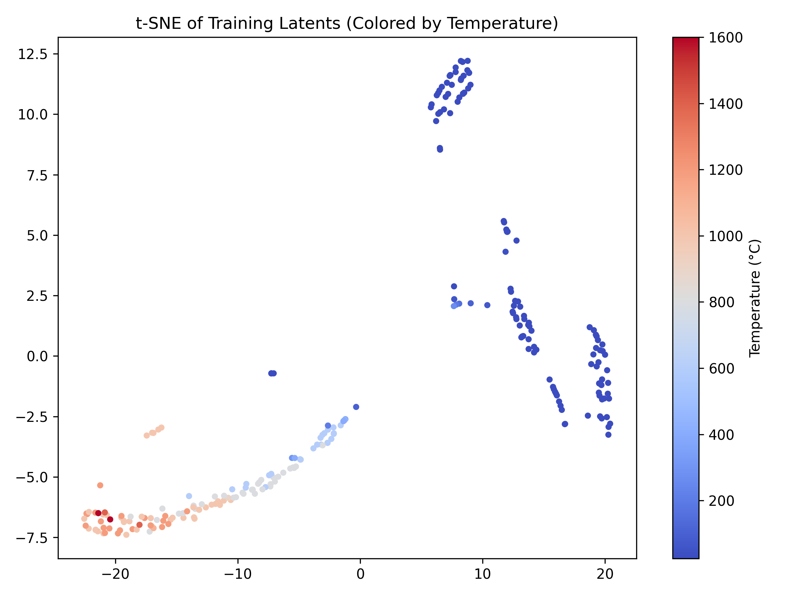

# RHEA Inverse Design Using CVAE

This project implements a **Conditional Variational Autoencoder (CVAE)** for the **inverse design of Refractory High-Entropy Alloys (RHEAs)**.  
The system generates novel alloy compositions conditioned on temperature and predicts their **yield strength (MPa)**, enabling **multi-objective alloy design**.

---

## Features
- **Data Preparation**
  - Encodes elemental fractions and processing conditions.
  - Standardizes inputs/outputs and saves scalers.
- **Model Training (`train_cvae.ipynb`)**
  - Trains a CVAE to reconstruct alloy compositions and predict yield strength.
  - Includes KL warmup, early stopping, and gradient clipping.
- **Evaluation (`evaluate_cvae.py`)**
  - Query 1: Highest yield strength alloys at a given temperature.  
  - Query 2: Alloys close to a target yield strength (optionally at a given temperature).  
  - Query 3: Multi-objective design — alloys satisfying multiple strength constraints across temperatures.
- **Generation (`generate.py`)**
  - Samples alloys from the latent space with optional element count limits (flexible masking).
- **Latent Space Visualization (`latent_vis.py`)**
  - Uses **t-SNE** to visualize the latent space distribution of alloys.
  - Colors embeddings by yield strength or testing temperature.
- **Explainability (`explain_diag.py`)**
  - Uses **Integrated Gradients (IG)** from Captum to attribute contributions of each element.
  - Compares IG scores with dataset-level correlations to detect bias or alignment.
- **Dataset Diagnostics (`check_dataset_corr.py`)**
  - Correlates elemental fractions with yield strength (Pearson & Spearman).
  - Provides a baseline for interpreting explainability results.

---

## Installation
```bash
git clone <https://github.com/shruti-sivakumar/RHEA-Inverse-Design-Using-VAE>
cd RHEA-Inverse-Design-Using-VAE
pip install -r requirements.txt
```

Dependencies:
- Python 3.9+
- PyTorch, scikit-learn, pandas, numpy, matplotlib
- captum (for explainability)

---

## Usage

### 1. Train the CVAE
```bash
python src/train_cvae.ipynb
```

### 2. Run Alloy Design Queries
```bash
python src/evaluate_cvae.py
```

### 3. Visualize Latent Space
```bash
python src/latent_vis.py
```

### 4. Explain Model Predictions
```bash
python src/explain_diag.py --temp 800 --N 200
```

### 5. Dataset vs IG Comparison
```bash
python src/check_dataset_corr.py
```

---

## Outputs
- `outputs/query*_*.csv` → Designed alloys with predicted yield strength.
- `outputs/query*_*.png` → Scatter plots of generated candidates.
- `outputs/latent_tsne_*.png` → Latent space visualization.
- `outputs/explain/` → Attribution results (`.csv` and plots).

Example:

**Query 1 Plot (Top Strength Alloys)**  


**Latent Space


**Latent Space (Colored by Yield Strength)**  


**Latent Space (Colored by Temperature)**  


**Explainability Example**  


---

## Interpreting Results
- **Latent t-SNE plots**  
  - Check clustering by yield strength and temperature.  
  - Well-structured clusters indicate meaningful latent organization.
- **Explainability**  
  - Integrated Gradients highlight which elements contribute positively/negatively.  
  - Compare IG scores with dataset correlations to detect potential biases.
- **Model Trust**  
  - If IG importance aligns with domain knowledge or dataset correlations, predictions are more reliable.  
  - Divergence may suggest data imbalance or model bias.

---

## Future Work
- Expand dataset coverage at high temperatures.
- Use advanced XAI methods (SHAP, LIME for tabular data).
- Incorporate uncertainty estimation in predictions.

---

## License
MIT License [License]