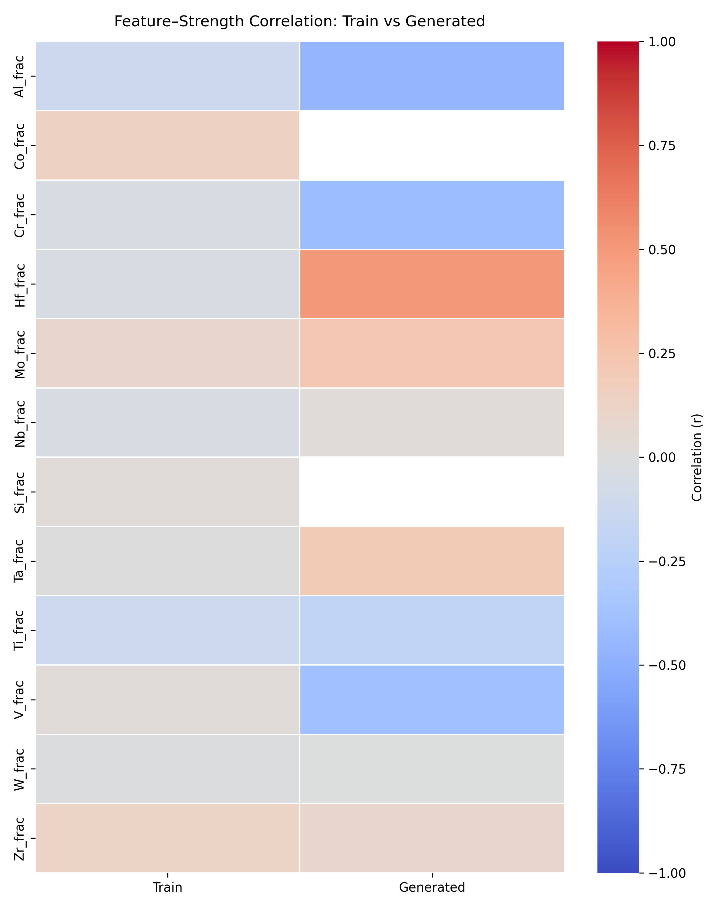
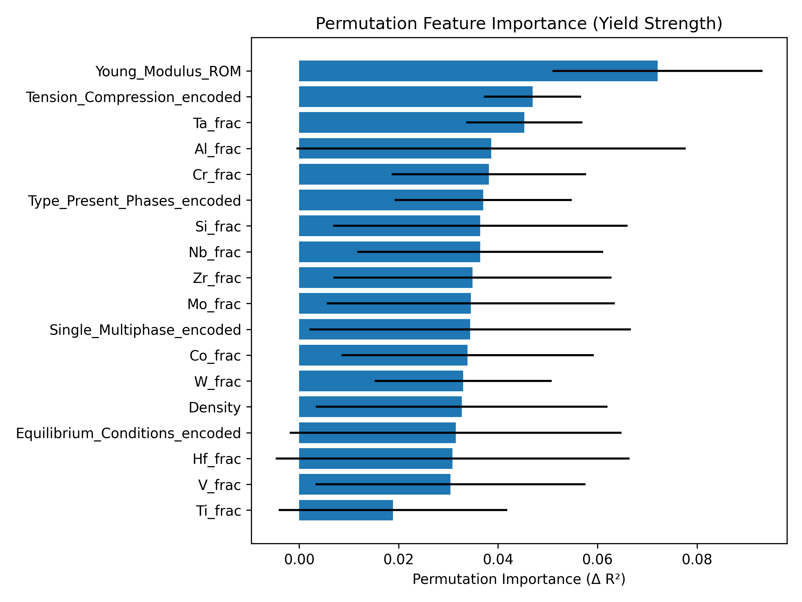

# RHEA-Inverse-Design-Using-CVAE

This repository implements a **Conditional Variational Autoencoder (CVAE)** for the **inverse design of Refractory High Entropy Alloys (RHEAs)**, focusing on predicting and generating candidate alloys with optimized **yield strength** under varying testing temperatures.

---

## Project Overview

- **Domain**: Materials Informatics, Inverse Design, Deep Generative Models  
- **Objective**: Generate new alloy compositions with desired mechanical properties (e.g., yield strength at high temperatures).  
- **Approach**:  
  1. Encode alloy compositions, processing conditions, and properties into latent space.  
  2. Train a **CVAE** conditioned on temperature.  
  3. Generate candidate alloys matching target yield strength.  
  4. Validate with **explainability analysis** (correlation + permutation feature importance).  

---

## Repository Structure

```
RHEA-Inverse-Design-Using-VAE/
│
├── data/
│   ├── scripts/rhea_data_encoding.py     # Data cleaning & encoding
│   ├── data.csv                          # Raw dataset
│   ├── encoded_data.csv                  # Cleaned + encoded dataset (model input)
│   └── processed/                        # Processed splits + scalers
│
├── models/
│   └── cvae_best.pt                      # Trained model checkpoint
│
├── outputs/                              # Generated alloys, plots, explainability results
│   ├── explainability/
│       ├── correlation_train_vs_generated.png
│       └── pfi_importance.png
│   └── tsne/
│       ├── latent_tsne_all.png
│       ├── latent_tsne_yield_strength.png
│       └── latent_tsne_temperature.png
│
├── src/
│   ├── data_prep.py              # Train/val split, scaling
│   ├── cvae.py                   # CVAE model definition
│   ├── train_cvae.py             # Training script with early stopping
│   ├── generate.py               # Alloy generation (sampling + refinement)
│   ├── evaluate_cvae.py          # Interactive query interface
│   ├── latent_vis.py             # Latent space visualization (t-SNE)
│   └── explainability.py         # Correlation + PFI explainability
│
└── README.md
```

---

## Installation

```bash
git clone <https://github.com/shruti-sivakumar/RHEA-Inverse-Design-Using-VAE>
cd RHEA-Inverse-Design-Using-VAE
pip install -r requirements.txt
```

Requirements:
- Python 3.9+
- PyTorch
- NumPy, Pandas, Scikit-learn
- Seaborn, Matplotlib
- Joblib

---

## Usage

### 1. Data Cleaning & Encoding
```bash
python data/scripts/rhea_data_encoding.py
```
Generates:
- `encoded_data.csv` (model-ready, numeric)
- `encoded_data_human.csv` (readable, for analysis)

### 2. Preprocessing
```bash
python src/data_prep.py
```
Outputs scalers + splits in `data/processed/`.

### 3. Train CVAE
```bash
python src/train_cvae.py
```
- Early stopping enabled  
- Saves best model to `models/cvae_best.pt`  

### 4. Generate Candidate Alloys
```bash
python src/evaluate_cvae.py
```
Interactive menu with 3 query modes:
1. Highest yield strength at given temperature  
2. Closest to a target yield strength  
3. Multi-constraint (two temperature constraints)

### 5. Latent Space Visualization
```bash
python src/latent_vis.py
```
- t-SNE plots of latent distribution  
- Colored by yield strength & temperature  

### 6. Explainability
```bash
python src/explainability.py
```
Produces:
- **Correlation heatmap**: Train vs Generated alloys  
- **Permutation Feature Importance (PFI)** plot

---

## Results & Visualizations

### Latent Space (t-SNE)
  
  
  

### Explainability
**Correlation Heatmap (Train vs Generated):**  
  

**Permutation Feature Importance (PFI):**  
  

---

## Key Insights

- CVAE can successfully generate novel alloy compositions with desired yield strength.  
- Strong conditioning ensures properties are tuned for different testing temperatures.  
- Explainability confirms both **data fidelity** (correlation analysis) and **model interpretability** (PFI).  

---

## Next Steps

- Add case-study **Integrated Gradients (IG)** for per-alloy local explanations.  
- Benchmark against other generative models (GANs, diffusion models).  
- Validate generated alloys with external simulation/experimental datasets.  

---

## License

This project is licensed under the **MIT License** – see the LICENSE file for details.